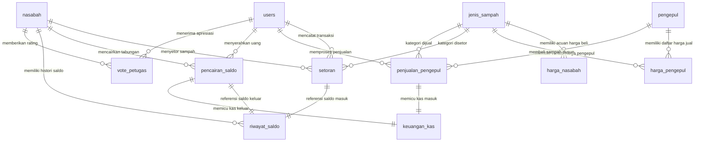
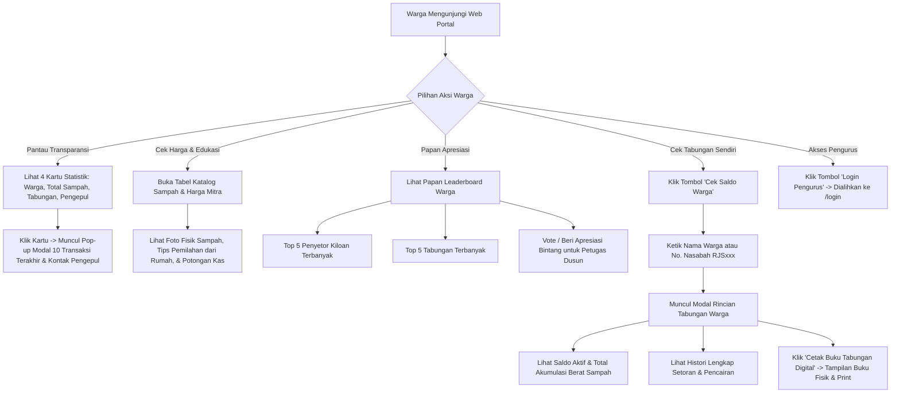
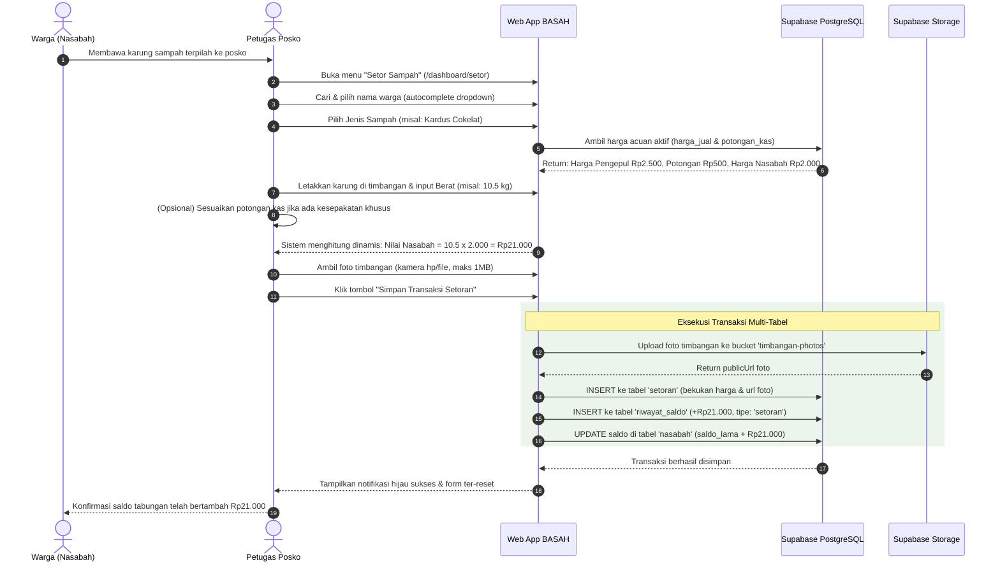
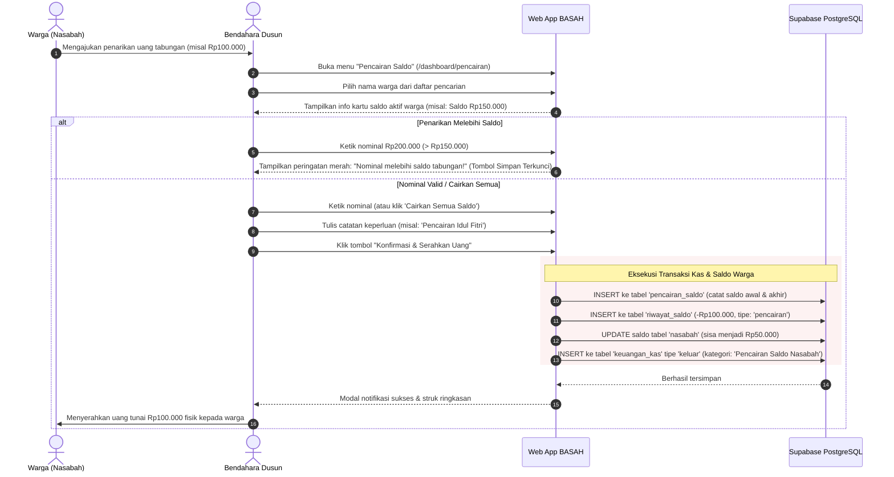
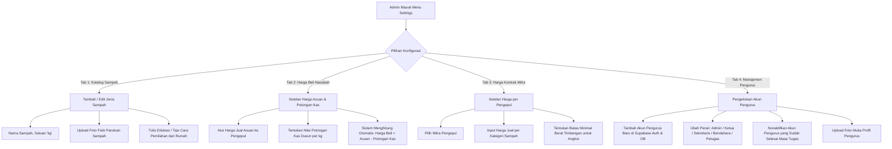

# DOKUMENTASI FLOW & ARSITEKTUR SISTEM WEBAPP BASAH REJOSARI
**Sistem Informasi & Transaksi Administrasi Bank Sampah Rejosari, Wedomartani**
*Pengembangan & Digitalisasi Program Kerja KKN Unit 57 Angkatan 73*

---

## 1. Gambaran Umum Proyek (Executive Overview)

**BASAH Rejosari (BAnk SAmpaH Rejosari)** adalah sistem informasi terpadu berbasis web yang dirancang untuk mendigitalisasi operasional harian, transparansi publik, penimbangan sampah, administrasi keuangan kas, dan manajemen tabungan warga di Dusun Rejosari, Wedomartani.

Sistem ini dirancang bukan sekadar aplikasi pencatatan biasa, melainkan **sistem transaksi terdistribusi multi-peran** yang membagi tata kelola bank sampah ke dalam 3 (tiga) pilar utama:
1. **Transparansi Publik & Nasabah (Public & Citizen Layer)**: Warga dapat memantau kontribusi sampah, melihat fluktuasi harga acuan, mengecek tabungan keluarga secara mandiri menggunakan nomor ID, hingga mencetak buku tabungan digital.
2. **Operasional Penimbangan Lapangan (Operational & Field Layer)**: Petugas operasional menimbang sampah di posko, mencatat transaksi secara cepat, menghitung kalkulasi otomatis, dan mengunggah bukti foto timbangan langsung ke cloud storage.
3. **Pengelolaan Kas & Kebijakan (Financial & Administrative Layer)**: Pengurus (Bendahara, Sekretaris, Ketua, Admin) mengelola arus kas bank sampah, transaksi penjualan ke mitra pengepul, pencairan tabungan warga, laporan berkala, hingga konfigurasi harga dan hak akses.

### Prinsip Dasar Bisnis BASAH Rejosari:
* **1 Rumah / Keluarga = 1 Akun Nasabah**: Sistem menggunakan nama satu orang perwakilan keluarga (misal: "Bapak Anto" atau "Ibu Maryati") dengan format nomor nasabah terstandarisasi (`RJS001`, `RJS002`, dst.). Tidak perlu menyimpan NIK/Nomor KK demi kemudahan registrasi dan keamanan privasi.
* **Pembekuan Harga Transaksi (Snapshot Pricing)**: Harga sampah saat disetor nasabah atau dijual ke pengepul **dibekukan (freeze)** ke dalam basis data transaksi. Perubahan harga di masa depan tidak akan pernah merusak nilai transaksi masa lalu.
* **Audit Trail Saldo Tanpa Manipulasi Siluman**: Setiap penambahan saldo dari setoran ataupun pengurangan dari pencairan wajib tercatat di tabel log riwayat saldo (`riwayat_saldo`) lengkap dengan saldo awal, nominal, saldo akhir, dan ID transaksi rujukan.
* **Model Bagi Hasil / Potongan Kas Dusun**:
  $$\text{Harga Bersih Nasabah} = \text{Harga Acuan Pengepul} - \text{Potongan Kas Dusun}$$
  Selisih potongan kas tersebut menjadi kas operasional bank sampah, dana perawatan alat timbangan, dan insentif petugas dusun.

---

## 2. Aktor & Matriks Hak Akses (Role & Authorization)

Sistem memiliki **6 Tingkatan Peran (Roles)** dengan batasan akses halaman dan aksi yang ketat:

```text
                               ┌────────────────────────┐
                               │   PORTAL PUBLIK /      │
                               │   WARGA DESA (Viewer)  │
                               └───────────┬────────────┘
                                           │ Akses Terbuka Tanpa Login
                                           ▼
┌──────────────────────────────────────────────────────────────────────────────────────────────────┐
│                                 DASHBOARD PENGURUS (Perlu Login)                                 │
├───────────────────┬───────────────────┬───────────────────┬───────────────────┬──────────────────┤
│   ADMIN SISTEM    │       KETUA       │     BENDAHARA     │    SEKRETARIS     │     PETUGAS      │
│     (Superuser)   │  (Pengawas & SPV) │    (Finansial)    │  (Administrasi)   │  (Pos Timbang)   │
└───────────────────┴───────────────────┴───────────────────┴───────────────────┴──────────────────┘
```

### Matriks Akses Fitur & Menu:

| Fitur / Halaman | Viewer Publik | Petugas Operasional | Bendahara | Sekretaris | Ketua | Admin Sistem |
| :--- | :---: | :---: | :---: | :---: | :---: | :---: |
| **Landing Page & Cek Tabungan Warga** (`/`) | ✔ (Read & Vote) | ✔ | ✔ | ✔ | ✔ | ✔ |
| **Login Pengurus** (`/login`) | ❌ | ✔ | ✔ | ✔ | ✔ | ✔ |
| **Dashboard Utama Pengurus** (`/dashboard`) | ❌ | ✔ (Read) | ✔ (Read) | ✔ (Read) | ✔ (Read) | ✔ (Read) |
| **Manajemen Data Nasabah** (`/dashboard/nasabah`) | ❌ | ✔ (Read Only) | ✔ (CRUD) | ✔ (CRUD) | ✔ (Read) | ✔ (CRUD) |
| **Input Setoran Sampah** (`/dashboard/setor`) | ❌ | ✔ (Create & Rollback) | ❌ | ❌ | ✔ (Read/Create) | ✔ (Full) |
| **Pencairan Tabungan Warga** (`/dashboard/pencairan`) | ❌ | ❌ | ✔ (Create & Rollback) | ❌ | ❌ | ✔ (Full) |
| **Kemitraan & Penjualan Pengepul** (`/dashboard/pengepul`) | ❌ | ❌ | ✔ (CRUD & Transaksi) | ❌ | ✔ (Read) | ✔ (Full) |
| **Manajemen Arus Kas Dusun** (`/dashboard/keuangan`) | ❌ | ❌ | ✔ (CRUD Kas) | ❌ | ✔ (Read) | ✔ (Full) |
| **Laporan Kas & Event Dusun** (`/dashboard/laporan`) | ❌ | ❌ | ✔ (Read & Cetak) | ✔ (Read & Cetak) | ✔ (Read & Cetak) | ✔ (Full) |
| **Panduan SOP Role** (`/dashboard/panduan`) | ❌ | ✔ (Read) | ✔ (Read) | ✔ (Read) | ✔ (Read) | ✔ (Read) |
| **Pengaturan Master & Pengurus** (`/dashboard/settings`) | ❌ | ❌ | ❌ | ❌ | ❌ | ✔ (Full CRUD) |

---

## 3. Arsitektur Basis Data & Hubungan Entitas (ERD)

Sistem menggunakan database PostgreSQL melalui platform **Supabase** dengan 12 tabel utama dan 3 View analitik:



### Rincian Tabel Database:
1. **`users`**: Menyimpan akun petugas/pengurus (nama, email, role, status aktif/nonaktif, foto profil).
2. **`nasabah`**: Menyimpan data perwakilan rumah (no_nasabah format `RJSxxx`, nama, rt_rw, no_hp, saldo tabungan aktif, foto profil).
3. **`jenis_sampah`**: Master katalog sampah yang diterima (nama sampah, satuan 'kg', foto fisik panduan pilah, deskripsi tips pemilahan dari rumah).
4. **`harga_nasabah`**: Harga acuan aktif untuk warga (`harga_jual` acuan, `potongan_kas`, dan kalkulasi `harga_beli = harga_jual - potongan_kas`).
5. **`pengepul`**: Master mitra pembeli sampah (nama mitra, kontak telepon/WA, alamat, jadwal rutin penjemputan).
6. **`harga_pengepul`**: Harga kontrak per pengepul untuk masing-masing jenis sampah, dilengkapi batas `minimal_berat` timbangan agar layak diangkut.
7. **`setoran`**: Data transaksi sampah masuk dari warga (nasabah_id, jenis_sampah_id, berat, snapshot harga jual, snapshot potongan kas, snapshot harga beli, total nominal rupiah, foto bukti timbangan di storage, petugas_id, tanggal).
8. **`penjualan_pengepul`**: Data penjualan akumulasi sampah dusun ke pengepul (pengepul_id, jenis_sampah_id, berat, harga jual saat transaksi, total pendapatan rupiah, petugas_id, tanggal).
9. **`pencairan_saldo`**: Transaksi penarikan tabungan warga (nasabah_id, nominal_pencairan, saldo_awal, saldo_akhir, petugas_id, tanggal).
10. **`riwayat_saldo`**: Ledger audit trail mutasi saldo warga (nasabah_id, tipe: `'setoran'|'pencairan'`, reference_id, nominal +/- rupiah, saldo_akhir setelah mutasi, keterangan waktu).
11. **`keuangan_kas`**: Buku kas umum operasional bank sampah (tipe: `'masuk'|'keluar'`, kategori misal: *"Penjualan Pengepul"*, *"Pencairan Saldo Nasabah"*, *"Fee Petugas"*, nominal, keterangan, tanggal).
12. **`vote_petugas`**: Fitur partisipatif warga untuk memberikan 1 vote ulasan/bintang kepada petugas dusun favorit.
13. **Views Pendukung**:
    - `view_leaderboard_berat`: 5 warga dengan total kiloan setoran sampah terbanyak.
    - `view_leaderboard_saldo`: 5 warga dengan tabungan tertinggi yang belum dicairkan.
    - `view_leaderboard_rating`: Rekapitulasi suara vote warga untuk apresiasi kinerja pengurus posko.

---

## 4. Alur Bisnis & Alur Kerja Lengkap (End-to-End Workflows)

Berikut adalah panduan detail alur kerja setiap modul pada Web App BASAH Rejosari:

---

### FLOW 1: Portal Transparansi Publik & Cek Tabungan Warga (`/`)

Portal publik adalah beranda tanpa login yang dapat diakses oleh seluruh warga Dusun Rejosari melalui smartphone atau komputer.



#### Rincian Langkah Flow 1:
1. **Inspeksi Statistik Real-Time**:
   - Warga melihat 4 kartu metrik utama di bagian atas.
   - Mengklik kartu **"Total Sampah"** memunculkan modal daftar 10 riwayat penimbangan terakhir di dusun.
   - Mengklik kartu **"Total Tabungan"** memunculkan modal 10 mutasi setoran/pencairan terakhir warga.
   - Mengklik kartu **"Mitra Pengepul"** memunculkan daftar kontak pengepul dan jadwal jemput sampah.
2. **Cek Tabungan Warga Mandiri**:
   - Warga tidak perlu mengingat password. Cukup klik tombol pencarian saldo, lalu ketik nama perwakilan (misal *"Bapak Anto"*) atau No. Nasabah (*"RJS001"*).
   - Sistem menampilkan kartu identitas warga, saldo saat ini, total kg sampah yang sudah disetor, serta riwayat mutasi.
   - Warga dapat mengeklik tombol **"Buka Buku Tabungan"** yang menampilkan simulasi visual buku tabungan perbankan lengkap dengan nomor registrasi, cap resmi, dan tombol cetak/simpan PDF.
3. **Edukasi Pemilahan & Transparansi Harga**:
   - Warga dapat memeriksa harga per kg setiap kategori sampah yang berlaku di pengepul rekanan.
   - Terdapat foto panduan sampah (misal: botol plastik bersih tanpa label) dan tips cara membersihkannya dari rumah sebelum dibawa ke posko penimbangan.
4. **Leaderboard & Vote Petugas**:
   - Mengapresiasi warga teraktif penyetor sampah demi meningkatkan semangat lingkungan di tingkat RT.
   - Warga dapat memberikan vote apresiasi untuk petugas operasional posko yang melayani dengan ramah.

---

### FLOW 2: Alur Penyetoran Sampah Masuk (`/dashboard/setor`)

Alur ini dilakukan di posko penimbangan pada hari operasional bank sampah oleh **Petugas Operasional** atau **Admin**.



#### Rincian Logika & Pencegahan Galat (Flow 2):
* **Pencarian Cepat Warga**: Petugas cukup mengetik awalan nama atau RT warga pada kolom pencarian autocomplete tanpa perlu menggulir daftar panjang nasabah.
* **Perhitungan Real-Time & Rumus Margin**:
  $$\text{Harga Beli Nasabah} = \text{Harga Jual Pengepul} - \text{Potongan Kas}$$
  $$\text{Total Hak Warga (Masuk Saldo)} = \text{Berat (kg)} \times \text{Harga Beli Nasabah}$$
  $$\text{Estimasi Kas Dusun} = \text{Berat (kg)} \times \text{Potongan Kas}$$
* **Fleksibilitas Petugas**: Nilai potongan kas terisi otomatis dari sistem, tetapi dapat diubah secara manual pada form jika terdapat kondisi istimewa (misal: sampah kotor atau kesepakatan penimbangan khusus).
* **Validasi Foto Timbangan**: Sistem membatasi ukuran file maksimal 1 MB agar database dan storage tidak boros kuota serta cepat diakses di jaringan seluler.
* **Fitur Rollback / Batal Setoran**: Jika petugas keliru memasukkan angka timbangan (misal harusnya 1.5 kg terketik 15 kg), petugas dapat membuka tab **"Riwayat Setoran"**, lalu klik tombol **Hapus**. Sistem otomatis membatalkan setoran, memotong kembali saldo nasabah sebesar nominal yang keliru, menghapus log riwayat saldo, dan menghapus file foto dari storage.

---

### FLOW 3: Alur Penjualan Sampah ke Mitra Pengepul (`/dashboard/pengepul`)

Alur ini dilakukan ketika sampah yang terkumpul di gudang bank sampah sudah mencapai volume tertentu dan dijemput oleh mitra pengepul. Fitur ini diakses oleh **Bendahara** atau **Ketua**.

```mermaid
flowchart TD
    A[Gudang Sampah Terisi / Jadwal Jemput Mitra Tiba] --> B[Bendahara Buka Menu 'Pengepul' (/dashboard/pengepul)]
    B --> C[Klik Tombol 'Input Penjualan ke Pengepul']
    C --> D[Pilih Mitra Pengepul Pembeli]
    D --> E[Pilih Jenis Sampah yang Dijual]
    
    subgraph Sinkronisasi Otomatis Stok Gudang
    E --> F[Sistem Memuat Stok Tersedia = Total Setoran Warga - Total Terjual Lalu]
    F --> G[Dropdown Menampilkan Label Stok per Jenis Sampah]
    F --> H[Input Berat Langsung Terisi Otomatis: DEFAULT SELURUH STOK TERCATAT]
    end
    
    H --> I{Pengurus Ingin Menjual Berapa?}
    I -->|Jual Seluruhnya| J[Gunakan Berat Penuh Default]
    I -->|Jual Sebagian| K[Ubah Angka Berat Sesuai Kapasitas Armada Pengepul]
    K --> K1[Tersedia Tombol 'Gunakan Semua' untuk Reset Cepat]
    
    J & K --> L[Sistem Menghitung Dinamis: Total Uang Kas = Berat x Harga Pengepul]
    L --> M[Bendahara Klik 'Simpan Transaksi']
    
    subgraph Dampak Otomatis Sistem
    M --> N[1. INSERT ke tabel 'penjualan_pengepul' sebagai rekaman niaga]
    M --> O[2. INSERT ke tabel 'keuangan_kas' tipe 'masuk' kategori 'Penjualan Pengepul']
    M --> P[3. Stok Jenis Sampah Tersebut Berkurang Otomatis untuk Transaksi Berikutnya]
    end
    
    N & O & P --> Q[Saldo Kas Bertambah & Uang Tunai Diterima dari Pengepul]
```

#### Aturan Bisnis Khusus (Flow 3):
* **Sinkronisasi Stok Gudang Otomatis**: Stok dihitung secara riil dari akumulasi setoran warga dikurangi penjualan masa lalu:
  $$\text{Stok Tersedia} = \sum(\text{Setoran Warga}) - \sum(\text{Penjualan Pengepul})$$
* **Default Seluruh Stok**: Saat jenis sampah dipilih, nilai berat otomatis terisi seluruh stok yang tercatat di gudang agar pengurus tidak perlu menghitung atau mengetik ulang.
* **Fleksibilitas Parsial**: Pengurus tetap dapat mengedit berat jika hanya sebagian sampah yang diangkut oleh mitra.
* **Peringatan Batas Stok**: Jika pengurus memasukkan berat melebihi catatan stok di gudang, sistem memberikan peringatan peringatan visual ramah agar pengurus memastikan keakuratan fisik sampah.
* **Harga Berbeda per Pengepul**: Setiap mitra pengepul memiliki kesepakatan harga beli masing-masing yang disimpan di tabel `harga_pengepul`.
* **Batas Minimal Berat (Threshold)**: Terdapat batas `minimal_berat` timbangan agar pengurus dapat memastikan kuota angkut terpenuhi.
* **Integrasi Kas Otomatis**: Pendapatan penjualan sampah otomatis masuk ke buku kas bank sampah (`keuangan_kas`) sebagai arus kas masuk.

---

### FLOW 4: Alur Pencairan Saldo / Penarikan Tabungan Warga (`/dashboard/pencairan`)

Alur ini dilakukan saat warga ingin mengambil uang hasil tabungan sampahnya (misal menjelang hari raya, tahun ajaran baru sekolah, atau saat pertemuan rutin RT). Khusus dikelola oleh **Bendahara** atau **Admin**.



#### Poin Penting Keamanan Saldo (Flow 4):
* **Pencairan Fleksibel**: Warga diperbolehkan mencairkan **sebagian saldo** atau **seluruh saldo** sampai Rp0.
* **Pencegahan Saldo Minus**: Input nominal dibatasi secara ketat di sisi antarmuka dan validasi logika. Nominal tidak boleh $\le 0$ dan tidak boleh $> \text{saldo aktif nasabah}$.
* **Pengeluaran Kas Otomatis**: Penyerahan uang tabungan warga dicatat otomatis sebagai **Kas Keluar** di tabel `keuangan_kas` agar fisik kas yang dipegang Bendahara selalu seimbang dengan pembukuan digital.

---

### FLOW 5: Alur Pengelolaan Keuangan & Kas Dusun (`/dashboard/keuangan`)

Menu ini adalah buku besar kas (*cash flow*) bank sampah yang mencatat segala bentuk perputaran dana tunai bank sampah.

```text
                               ┌────────────────────────┐
                               │  TOTAL SALDO KAS AKTIF │
                               │ (Kas Masuk - Keluar)   │
                               └───────────┬────────────┘
                                           │
                ┌──────────────────────────┴──────────────────────────┐
                ▼                                                     ▼
     TOTAL PEMASUKAN (KAS MASUK)                           TOTAL PENGELUARAN (KAS KELUAR)
 ┌──────────────────────────────────────┐              ┌──────────────────────────────────────┐
 │ • Penjualan Sampah ke Pengepul       │              │ • Pencairan Tabungan Nasabah         │
 │   (Otomatis dari Modul Pengepul)     │              │   (Otomatis dari Modul Pencairan)    │
 │ • Iuran / Bantuan Kas Dusun / RT     │              │ • Pembagian Bagi Hasil / Fee Petugas │
 │ • Hibah / Donasi Lingkungan Hidup    │              │ • Pembelian Timbangan / Karung / ATK │
 │ • Pemasukan Lain-lain (Manual)       │              │ • Operasional Konsumsi & Angkut      │
 └──────────────────────────────────────┘              └──────────────────────────────────────┘
```

#### Alur Kerja:
1. **Pencatatan Otomatis**: Pemasukan dari penjualan sampah ke pengepul dan pengeluaran dari pencairan tabungan warga otomatis tercatat di tabel ini tanpa entri ganda.
2. **Pencatatan Manual**: Bendahara dapat mengeklik tombol **"Tambah Transaksi Kas"** untuk mencatat biaya operasional riil lainnya, seperti:
   - Pembelian baterai timbangan digital atau karung sampah.
   - Pembagian insentif/fee kegiatan penimbangan bagi kader/petugas posko.
   - Penerimaan donasi atau bantuan operasional dari kas RT/RW.
3. **Kalkulasi Saldo Kas**: Sistem selalu menjumlahkan secara instan seluruh baris kas masuk dikurangi kas keluar, sehingga Bendahara dapat mencocokkan uang fisik di brankas/kotak kas dengan saldo di aplikasi setiap saat.

---

### FLOW 6: Alur Rekapitulasi & Pembuatan Laporan Resmi (`/dashboard/laporan`)

Modul ini digunakan oleh **Sekretaris**, **Bendahara**, dan **Ketua** untuk mempublikasikan pertanggungjawaban pada rapat dusun atau pertemuan rutin RT/RW.

Modul ini memiliki 2 Tab Laporan:

#### 1. Tab Laporan Periode Kas (Financial Periodic Report):
* **Pilihan Periode**: Pengurus dapat memilih rentang waktu: 1 Bulan, 2 Bulan, 3 Bulan (Kuartal), 6 Bulan (Semester), atau 1 Tahun Penuh.
* **Metrik yang Disajikan**:
  - Total volume sampah masuk (kg) dan nominal yang menjadi hak warga (Rp).
  - Total volume sampah terjual ke pengepul (kg) dan uang kas yang diterima (Rp).
  - Total tabungan warga yang telah dicairkan (Rp).
  - Pemasukan dan pengeluaran kas operasional lainnya.
  - **Surplus / Defisit Kas Bersih** pada periode yang dipilih.
* **Fitur Cetak Dokumen Resmi**: Menekan tombol **"Cetak Laporan"** akan mengaktifkan *print stylesheet* dokumen formal A4 lengkap dengan kop surat Bank Sampah Rejosari serta kolom tanda tangan basah untuk **Ketua**, **Sekretaris**, dan **Bendahara**.

#### 2. Tab Rekapitulasi Event Dusun (Penimbangan Harian RT/RW):
* **Pilihan Tanggal Kegiatan**: Pengurus memilih tanggal kegiatan penimbangan posko (misal: tanggal pertemuan dusun hari Minggu).
* **Rincian Per Warga**: Menampilkan tabel daftar warga yang hadir menyetor pada hari itu, rincian per jenis sampah yang dibawa, total kiloan per warga, dan total nominal rupiah tabungan yang berhasil dikumpulkan warga pada kegiatan tersebut.
* **Filter RT/RW**: Memudahkan pengurus mengevaluasi tingkat partisipasi warga RT 01, RT 02, RT 03, dst.
* **Cetak Lembar Rekap**: Dapat langsung dicetak sebagai lampiran arsip buku kerja posko penimbangan.

---

### FLOW 7: Alur Konfigurasi Sistem & Master Data (`/dashboard/settings`)

Menu ini khusus diakses oleh **Admin Sistem** untuk memelihara parameter operasional jangka panjang bank sampah:



---

## 5. Ringkasan Siklus Data Keuangan (Money Flow Circuit)

Sirkulasi uang di dalam ekosistem BASAH Rejosari berjalan dalam satu siklus tertutup yang transparan dan dapat diaudit:

```text
[1. Warga Menyetor Sampah]
    │   • Sampah ditimbang (misal: 10 kg botol)
    │   • Nilai: 10 kg x Rp2.000 (Harga Nasabah) = Rp20.000
    ▼
[2. Tabungan Warga Bertambah (Kewajiban Bank Sampah)]
    │   • Saldo digital warga bertambah: +Rp20.000
    │   • Belum ada uang tunai keluar
    ▼
[3. Penjualan Akumulasi Sampah ke Pengepul]
    │   • Sampah terkumpul dijual ke Pengepul seharga Rp3.000/kg
    │   • 10 kg x Rp3.000 = Rp30.000 uang tunai diterima dari Pengepul
    ▼
[4. Kas Dusun Menerima Pembayaran Pengepul]
    │   • Total Uang Masuk Kasir: Rp30.000
    │   • Alokasi:
    │     ├── Rp20.000 = Hak Nasabah (Dicadangkan untuk pencairan tabungan)
    │     └── Rp10.000 = Kas Dusun (Margin riil dari potongan kas Rp1.000/kg x 10 kg)
    ▼
[5. Warga Mengajukan Pencairan Tabungan]
    │   • Warga mencairkan Rp20.000
    │   • Bendahara menyerahkan uang tunai Rp20.000 dari kas cadangan
    │   • Saldo nasabah berkurang menjadi Rp0
    │   • Kas Bank Sampah berkurang -Rp20.000 (Pengeluaran Pencairan)
    ▼
[6. Surplus Bersih Kas Bank Sampah Tetap Bertahan]
    │   • Sisa di Kas Dusun: Rp10.000 (Surplus operasional yang aman)
    └─────────────────────────────────────────────────────────────
```

---

## 6. Panduan Pengamanan Transaksi & Keandalan Sistem (System Guardrails)

1. **Pencegahan Manipulasi Saldo (Audit Log Trail)**:
   - Setiap modifikasi saldo pada tabel `nasabah` selalu dibarengi dengan baris baru di tabel `riwayat_saldo`.
   - Riwayat saldo tidak pernah dihapus ketika nasabah melakukan penarikan uang, melainkan menambahkan rekaman mutasi negatif baru.
2. **Kekebalan Perubahan Harga Historis (Historical Immutability)**:
   - Nilai per transaksi setoran mengunci `harga_jual_saat_ini`, `potongan_kas_saat_ini`, dan `harga_beli_saat_ini`. Jika bulan depan harga sampah anjlok atau naik drastis, nilai rupiah pada transaksi yang sudah selesai tidak akan pernah terpengaruh.
3. **Penyimpanan Gambar Timbangan yang Ringan**:
   - Foto bukti timbangan di posko diunggah ke *Supabase Storage* (bucket `timbangan-photos`).
   - Sistem memvalidasi ukuran gambar maksimal 1 MB sebelum pengunggahan untuk memastikan performa aplikasi tetap gegas saat digunakan di perangkat smartphone petugas lapangan.
4. **Mekanisme Pembatalan Transaksi Human-Error (Safe Rollback)**:
   - Jika petugas posko salah memasukkan angka timbangan atau salah memilih nama nasabah, transaksi dapat dibatalkan melalui antarmuka riwayat setoran.
   - Pembatalan setoran secara aman akan memotong kembali saldo nasabah, mencatat penyesuaian, dan membersihkan file foto terkait.
5. **Dukungan Offline / Fallback Mock Data**:
   - Jika koneksi internet posko terganggu, aplikasi dilengkapi dengan sistem *mock fallback* agar pengurus tetap dapat melihat tata letak antarmuka dan melakukan simulasi alur penimbangan tanpa terjadi kendala *crash*.

---

## 7. Penutup & Serah Terima Program KKN

Sistem Web App **BASAH Rejosari** ini didesain agar mudah dioperasikan secara mandiri oleh kader dan pengurus Dusun Rejosari setelah masa KKN Unit 57 Angkatan 73 selesai:
- Seluruh hak akses utama (*Admin Sistem*) dapat dialihkan ke pengurus dusun yang ditunjuk melalui menu pengaturan pengurus.
- Buku panduan peran terintegrasi di dalam aplikasi pada menu **`/dashboard/panduan`** dapat dibaca sewaktu-waktu oleh pengurus baru tanpa memerlukan pelatihan teknis yang rumit.
- Sistem siap digunakan secara berkesinambungan untuk menciptakan lingkungan dusun yang bersih, berdaya, dan bernilai ekonomis.
